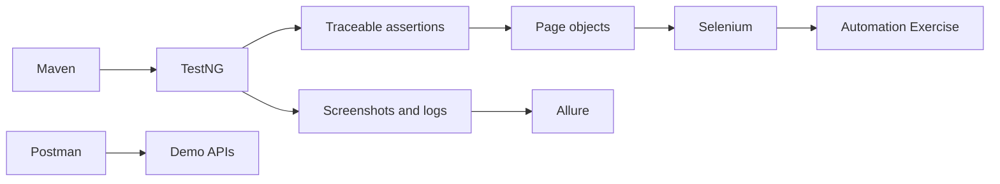

# QA Engineering Portfolio — Automation Exercise

A practical QA portfolio by **Anudeep Paladugu**, testing the public [Automation Exercise](https://automationexercise.com) shopping demo. The project covers discovery, requirements, manual test design, Selenium automation, Postman API checks, defect reporting and Allure evidence. Tools follow the owner's resume; the framework stays small and runs serially.

## Actual results

Executed on **7 October 2026** against the shared public demo, using Chrome on Windows.

| Scope | Passed | Failed |
|---|---:|---:|
| Java UI regression | 20 | 1 |
| Postman collection verification | 9 | 0 |
| Agent-assisted exploratory checks | 2 | 1 |
| Total case records | 31 | 2 |

The API collection passed **40 assertions**. Both failed cases identify the same open application defect: adding quantity **-1** produces a **Rs. -500** cart total despite the input declaring `min=1`. The automated guard remains failing and Maven returns exit code 1. **QA recommendation: NO-GO** until the website owner fixes the defect and it is retested. This project cannot change the third-party website.

- [Final execution report](test-documentation/execution/execution-summary.md)
- [Reproduction steps and evidence for QA-PROD-001](test-documentation/defects/QA-PROD-001.md)
- [Latest UI results and Allure summary](evidence/latest-regression/README.md)
- [API execution evidence](evidence/postman/README.md) and [exploratory evidence](evidence/exploratory/README.md)

The final UI run tested source commit `290d148b3826804ab3440db5a453e68cb56970b3`. Subsequent commits deliver documentation and reports. Historical smoke and positive regression results remain labeled as historical; they do not replace this current failing result.

## What is included

- 19 observed functional requirements, 33 detailed cases and [requirement traceability](docs/01-requirements/06-requirement-traceability-matrix.md).
- Java 21, Selenium WebDriver, TestNG, Maven and page objects for account, catalog, search, cart, checkout and simulated order flows.
- 21 UI regression tests; eight selected for smoke. Fresh browser sessions, explicit waits, test-owned accounts and account cleanup.
- Screenshots at start, completion and meaningful checkpoints; structured logs, actual observations, browser metadata and Allure attachments. Failure capture was independently audited.
- Nine Postman requests with positive and negative assertions, verified using Postman's official Newman runner. No Postman GUI execution is claimed.
- [SQL validation design](docs/database/database-validation-design.md), clearly marked unexecuted because the public database is unavailable.
- [Strategy](docs/03-test-strategy/test-strategy.md), [plan](docs/04-test-plan/test-plan.md), [coverage](test-documentation/coverage-baseline.md), [QA approach](docs/qa-approach/qa-approach.md) and [interview walkthrough](docs/qa-approach/interview-walkthrough.md).

**Jenkins is skipped at the owner's request. CI is deferred; no pipeline run or CI artifact availability is claimed.**

## Run locally

Install Java 21, Maven 3.9+ and Chrome. Internet access is needed for dependencies, Selenium's driver and the demo. Clone and enter the repository:

```sh
git clone https://github.com/AnudeepPaladugu/qa-engineering-portfolio.git
cd qa-engineering-portfolio
```

Set a test-only password and record the checked-out revision. In PowerShell:

```powershell
$env:TEST_PASSWORD='choose-a-test-only-password'
$env:GIT_COMMIT=(git rev-parse HEAD)
mvn clean test '-Dgroups=regression'
```

On macOS/Linux:

```sh
export TEST_PASSWORD='choose-a-test-only-password'
export GIT_COMMIT=$(git rev-parse HEAD)
mvn clean test -Dgroups=regression
```

Tests generate unique synthetic accounts and delete them during cleanup. Do not supply personal account credentials. `.env.example` documents configuration; `.env` is not loaded automatically. Only Windows/Chrome was verified.

```sh
# Eight-case smoke selection, including the open defect guard
mvn clean test -DsuiteXmlFile=testng-smoke.xml -Dgroups=smoke
# One cart calculation case
mvn test -Dtest=PortfolioTests#cartTotal -Dgroups=regression
# Generate or serve the report after execution
mvn allure:report
mvn allure:serve
```

Regression and smoke currently return non-zero because of QA-PROD-001. The eight-case smoke selection was evaluated within the latest regression; a separate complete eight-case smoke run is not claimed. Before another independent run, preserve or move previous `artifacts/allure-results`: `mvn clean` clears `target`, not the evidence directory.

Runtime screenshots, logs and result records are in `artifacts/runs`; raw Allure data is in `artifacts/allure-results`; the generated report is in `artifacts/allure-report`. Full generated output is ignored by Git. Curated evidence is committed under `evidence`. See [complete run instructions](docs/how-to-run.md), [API import and verification](api-tests/README.md) and [failure-capture audit](docs/architecture/evidence-audit.md).

## Structure and design

```text
src/main/java/       Configuration, driver lifecycle and page objects
src/test/java/       TestNG tests, case metadata and evidence capture
postman/             Collection and example environment
docs/                Discovery, requirements, analysis, strategy and design
test-documentation/  Cases, scenarios, execution and defects
test-data/           Synthetic data guidance and inspected fixtures
evidence/            Curated actual results and screenshots
artifacts/           Ignored runtime evidence and reports
```



See [architecture](docs/architecture/architecture.md), [design decisions](docs/design-decisions/design-decisions.md), [resume alignment](docs/design-decisions/resume-alignment.md) and [final audit](docs/final-audit.md).

## Limits

The public environment has ads, shared fixtures and no exposed build identifier. Quantity validation is inferred from the observed DOM and requires owner confirmation. Orders use synthetic data and simulated payment. Exploratory checks were agent-assisted browser input and visual inspection, not human certification. Database execution, Jenkins, video, parallel execution and additional browsers are outside this delivery. No retry or forced click hides failures. No private resume or credentials are published.
