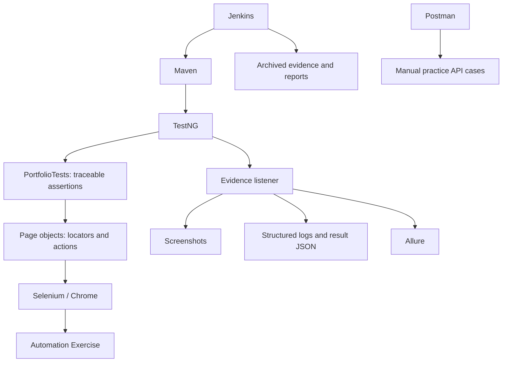

# Framework architecture

`src/main` contains configuration, driver lifecycle and page objects; `src/test` contains TestNG cases, case IDs and evidence. This keeps application interactions reusable without creating a general-purpose framework. PageFactory is unnecessary for this small explicit-wait model.

Configuration precedence is Java -D property, environment variable, then config.properties. TEST_PASSWORD has no default. `.env.example` documents values; `.env` is not automatically loaded. A fresh Chrome session is created per case; ThreadLocal stores it so accidental sharing is avoided, but the verified suites run serially. Selenium Manager resolves the driver. EAGER page loading avoids waiting for every advertising resource; explicit waits guard the actual controls. Intercepted clicks remain failures; the framework does not remove ads or use JavaScript to force clicks.

Tests create their own accounts through UI signup and delete only those accounts at teardown. A failed cleanup is a TestNG configuration failure and must lower release confidence even if the test body's assertions passed. Runtime evidence goes under artifacts/runs/<UTC timestamp>_<case>_<method>. Each result contains actual observations, timestamp, browser capabilities, environment and supplied Git commit. Passwords never enter step text or logs.

The listener captures start/completion/failure screenshots and attaches logs/results to Allure. Meaningful cart and payment checkpoints are explicit. SCREENSHOT_MODE=FAILURE reduces screenshot volume; failures are always captured. Allure steps use its runtime API, so AspectJ weaving is not required. No retry analyzer is configured. Video and parallel scheduling are deferred under the simplified resume-aligned scope.
