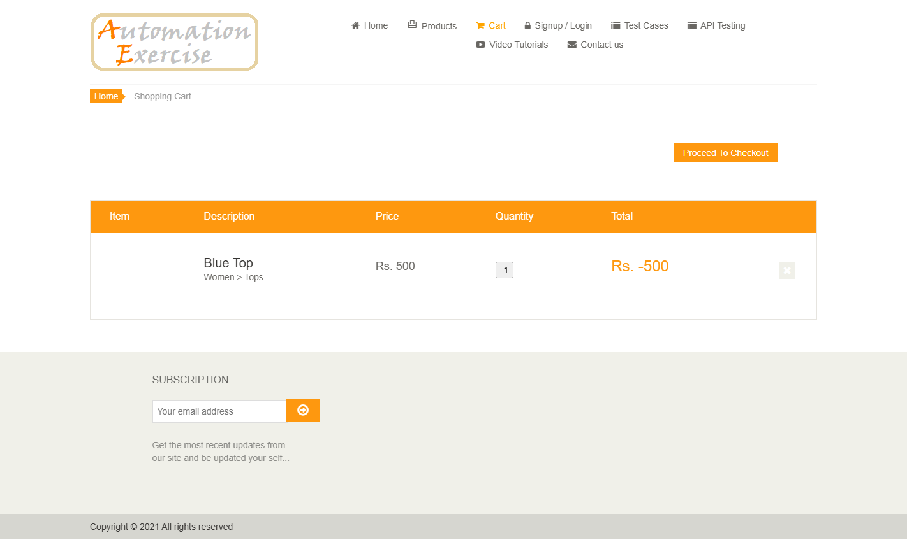
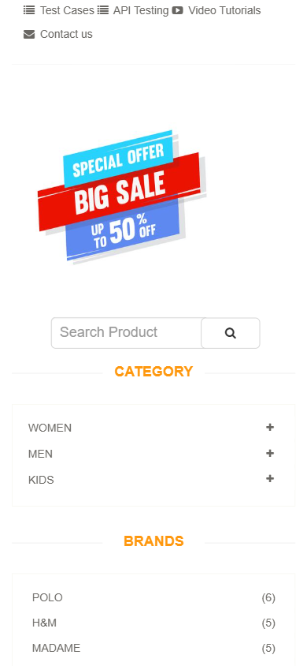
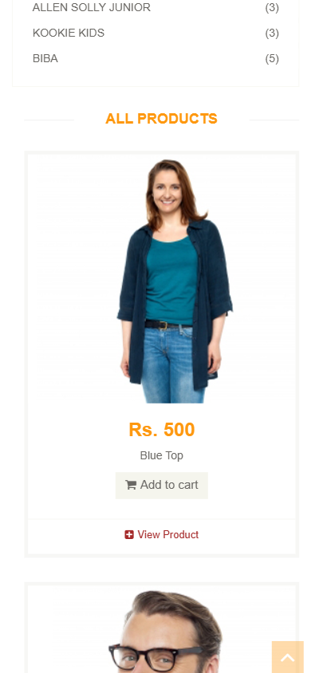

# Agent-assisted exploratory evidence

Two exploratory checks passed (keyboard reach/focus and 390x844 visual inspection). The synchronized quantity boundary check failed against the UI's declared min=1. See results.json and QA-PROD-001. These are agent-assisted observations, not claims that a human tester or accessibility specialist signed off.

Email before/after focus screenshots show the visible caret in the focused field. Complete observations and an independent negative-quantity reproduction are retained beside these images.
