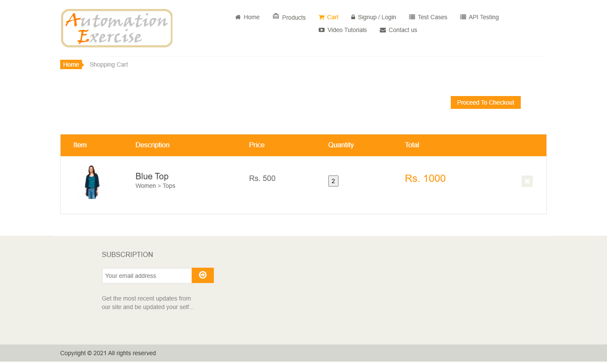
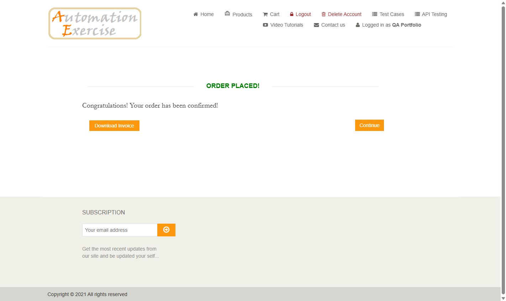

# Real UI regression evidence

Source commit: 8bbd37f4d61ee91603df2763f9b61ba467a9d27e. All 20 cases passed; results.json contains their actual observations. allure-summary.json was copied from the generated report.

Only two representative UI screenshots are committed; full runtime evidence stays in ignored artifacts/. The separate intentional failure screenshot is under evidence/framework-audit and is not an application defect.

